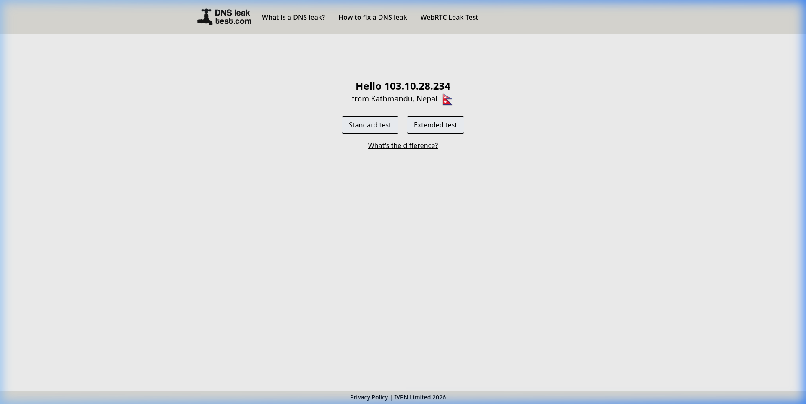
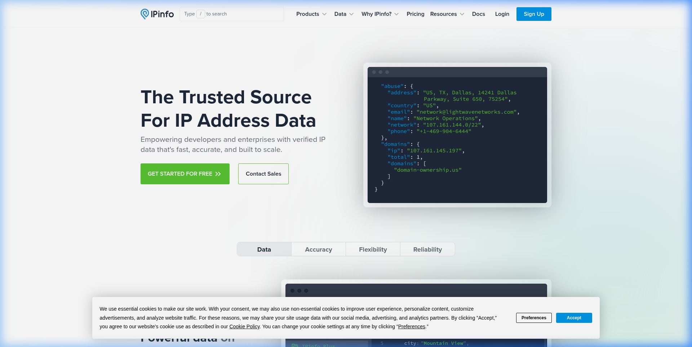
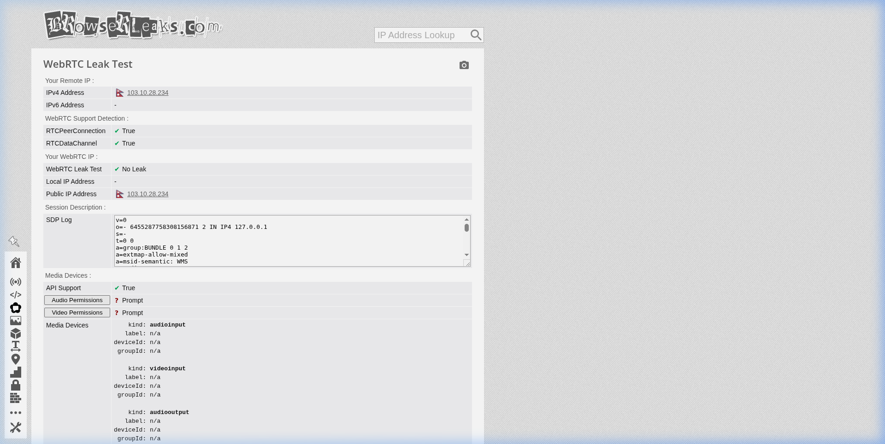
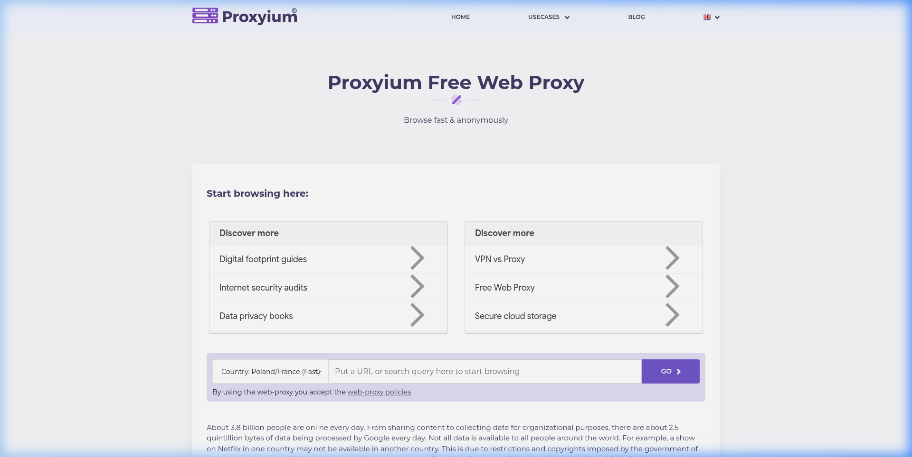
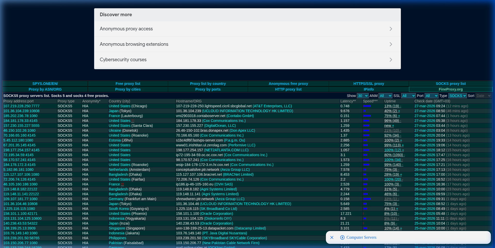
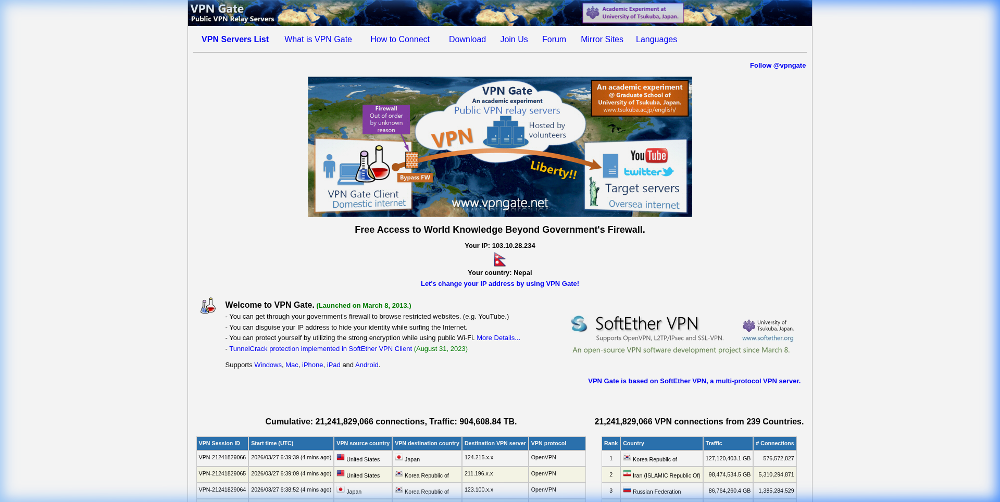

<div align="center">


<pre>
██████╗ ██████╗ ██╗██████╗
██╔══██╗██╔══██╗██║██╔══██╗
██║  ██║██████╔╝██║██████╔╝
██║  ██║██╔══██╗██║██╔═══╝
██████╔╝██║  ██║██║██║
╚═════╝ ╚═╝  ╚═╝╚═╝╚═╝
</pre>

<p>
  <b>The world's only all-in-one proxychains wrapper with live geo visualization,<br>
  DNS-safe browser mode, intelligent proxy rotation, country blacklisting,<br>
  and VPN integration for raw-socket tools — in a single Python file.</b>
</p>

<p>
  
  
  
</p>

<p>
  
  
</p>

<p>
  <a href="#-quick-start"><b>Quick Start</b></a> ·
  <a href="#-how-drip-works"><b>How It Works</b></a> ·
  <a href="#-usage--commands"><b>Usage</b></a> ·
  <a href="#-architecture--flow"><b>Architecture</b></a> ·
  <a href="#-browser-mode"><b>Browser Mode</b></a> ·
  <a href="#-configuration"><b>Config</b></a> ·
  <a href="#-version-history"><b>History</b></a>
</p>

</div>

---

## What is drip?

`drip` is a **single-file Python proxychains wrapper** that turns the raw, silent `proxychains4` binary into a full anonymity toolkit. Born from 3+ months of development and 380+ deleted prototypes.

```bash
cat proxies.txt | python3 drip_alpha.py sqlmap -u "http://target.com?id=1"
cat proxies.txt | python3 drip_alpha.py nmap -sT target.com
cat proxies.txt | python3 drip_alpha.py --browser
python3 drip_alpha.py curl https://example.com   # auto-Tor fallback
```

---

## 🧠 How drip Works

```
┌─────────────────────────────────────────────────────────────────┐
│                    WHAT DRIP DOES                                │
├─────────────────────────────────────────────────────────────────┤
│                                                                  │
│  WITHOUT drip:                                                   │
│  ┌──────────┐    ┌──────────────────┐    ┌──────────┐           │
│  │  YOU     │───▶│  proxychains4    │───▶│  TARGET  │           │
│  │ (blind)  │    │  (silent, dumb)  │    │          │           │
│  └──────────┘    └──────────────────┘    └──────────┘           │
│      No geo ❌   No rotation ❌   No DNS safety ❌               │
│                                                                  │
│  WITH drip:                                                      │
│  ┌──────────┐    ┌──────────────────────────────────────────┐   │
│  │ proxies  │───▶│              drip_alpha.py               │   │
│  │  .txt    │    │  ┌──────────┐ ┌──────────┐ ┌──────────┐ │   │
│  └──────────┘    │  │  PROBE   │ │   GEO    │ │ ROTATION │ │   │
│                  │  │ (filter) │ │(blacklist│ │ (smart)  │ │   │
│                  │  └────┬─────┘ └────┬─────┘ └────┬─────┘ │   │
│                  │       └────────────┴────────────┘        │   │
│                  │                   │                       │   │
│                  │            proxychains4                   │   │
│                  └──────────────────┬────────────────────────┘   │
│                                     │                            │
│                                     ▼                            │
│  ┌──────────────────────────────────────────────────────────┐    │
│  │  🇩🇪 PROXY 1 ──▶ 🇳🇱 PROXY 2 ──▶ 🇯🇵 PROXY 3 ──▶ TARGET │    │
│  │     45ms             89ms            134ms               │    │
│  └──────────────────────────────────────────────────────────┘    │
│   Live geo ✅   Smart rotation ✅   DNS-safe ✅   Browser ✅     │
│                                                                  │
└─────────────────────────────────────────────────────────────────┘
```

---

## 🚀 Quick Start

### Install Dependencies

```bash
# Ubuntu / Debian / Kali
sudo apt install proxychains4 python3 python3-pip curl tor firefox-esr

# Arch / Manjaro
sudo pacman -S proxychains-ng python python-pip curl tor firefox

# macOS
brew install proxychains-ng python3 curl tor
```

### Clone and Run

```bash
git clone https://github.com/kishwordulal1234/drip
cd drip
# rich, requests, pyyaml auto-install on first run
cat proxies.txt | python3 drip_alpha.py curl https://ipinfo.io
```

> **Note:** `drip_alpha.py` is the current version. `drip.py` is the original v1.

---

## ⚡ Usage & Commands

```
┌──────────────────────────────────────────────────────────────────┐
│                     DRIP COMMAND REFERENCE                        │
├──────────────────────────────────────────────────────────────────┤
│                                                                   │
│  BASIC USAGE:                                                     │
│  cat proxies.txt | python3 drip_alpha.py <tool> [args]           │
│                                                                   │
│  AUTO-TOR (no proxies piped):                                     │
│  python3 drip_alpha.py <tool> [args]                             │
│                                                                   │
│  BROWSER MODE:                                                    │
│  cat proxies.txt | python3 drip_alpha.py --browser               │
│                                                                   │
├──────────────────────────────────────────────────────────────────┤
│  TOOL          │  COMMAND                                         │
├────────────────┼─────────────────────────────────────────────────┤
│  curl          │  cat p.txt | python3 drip_alpha.py curl -s URL  │
│  nmap TCP      │  cat p.txt | python3 drip_alpha.py nmap -sT ... │
│  sqlmap        │  cat p.txt | python3 drip_alpha.py sqlmap -u .. │
│  ghauri        │  cat p.txt | python3 drip_alpha.py ghauri -u .. │
│  nikto         │  cat p.txt | python3 drip_alpha.py nikto -h ..  │
│  ffuf          │  cat p.txt | python3 drip_alpha.py ffuf -w ...  │
│  gobuster      │  cat p.txt | python3 drip_alpha.py gobuster ... │
│  browser       │  cat p.txt | python3 drip_alpha.py --browser    │
└────────────────┴─────────────────────────────────────────────────┘
```

### Examples

```bash
# Web scanning
cat proxies.txt | python3 drip_alpha.py curl -s https://ipinfo.io/json

# SQL injection
cat proxies.txt | python3 drip_alpha.py sqlmap -u "http://target.com?id=1"

# TCP nmap (auto-injects -sT -Pn)
cat proxies.txt | python3 drip_alpha.py nmap -sV -p 80,443 target.com

# Directory fuzzing
cat proxies.txt | python3 drip_alpha.py ffuf -w wordlist.txt -u http://target.com/FUZZ

# Tor auto-mode (no proxies piped)
python3 drip_alpha.py curl https://check.torproject.org

# Browser with proxy rotation
cat proxies.txt | python3 drip_alpha.py --browser
```

---

## 🏗️ Architecture & Flow

```
┌─────────────────────────────────────────────────────────────────────────────┐
│                         DRIP SYSTEM ARCHITECTURE                            │
└─────────────────────────────────────────────────────────────────────────────┘

                              ┌─────────────────┐
                              │   INPUT SOURCES │
                              └────────┬────────┘
                                       │
         ┌─────────────────────────────┼─────────────────────────────┐
         │                             │                             │
         ▼                             ▼                             ▼
┌─────────────────┐          ┌─────────────────┐          ┌─────────────────┐
│   proxies.txt   │          │   Tor Network   │          │   VPN Tunnel    │
│ (SOCKS5/HTTP)   │          │  (Auto-Fallback)│          │ (Proton/OpenVPN)│
└────────┬────────┘          └────────┬────────┘          └────────┬────────┘
         │                             │                             │
         └─────────────────────────────┼─────────────────────────────┘
                                       │
                                       ▼
                    ┌──────────────────────────────────┐
                    │      🔍 PROXY VALIDATION ENGINE   │
                    │  ┌─────────────┐  ┌─────────────┐ │
                    │  │  SOCKS5     │  │   HTTP      │ │
                    │  │  Probe      │  │   Probe     │ │
                    │  └─────────────┘  └─────────────┘ │
                    │  ┌─────────────┐  ┌─────────────┐ │
                    │  │  Latency    │  │   GeoIP     │ │
                    │  │  Sort       │  │   Lookup    │ │
                    │  └─────────────┘  └─────────────┘ │
                    └─────────────────┬─────────────────┘
                                      │
                                      ▼
                    ┌──────────────────────────────────┐
                    │     🌍 GEO FILTERING LAYER        │
                    │  Country Blacklist (CN, HK, etc.) │
                    │  Stats: CN: 12 | HK: 4 dropped   │
                    └─────────────────┬─────────────────┘
                                      │
                                      ▼
                    ┌──────────────────────────────────┐
                    │    ⚡ INTELLIGENT ROTATION        │
                    │  conn_ok ──┐                      │
                    │  conn_fail ┼──► rotate (if >=3)  │
                    │  hop_fail ─┘ (normal, no rotate) │
                    └─────────────────┬─────────────────┘
                                      │
                                      ▼
┌─────────────────────────────────────────────────────────────────────────────┐
│                    🎯 PROXYCHAINS4 EXECUTION LAYER                           │
│   ┌──────────┐     ┌──────────┐     ┌──────────┐     ┌──────────┐          │
│   │ Proxy 1  │────▶│ Proxy 2  │────▶│ Proxy 3  │────▶│ Target   │          │
│   │ 🇩🇪 45ms │     │ 🇳🇱 89ms │     │ 🇯🇵 134ms│     │          │          │
│   └──────────┘     └──────────┘     └──────────┘     └──────────┘          │
└─────────────────────────────────────────────────────────────────────────────┘
```

### Data Flow Diagram

```
          YOUR MACHINE [IP: hidden]
                 │
                 │ 1. pip proxies.txt
                 │ 2. Auto-probe & sort by latency
                 ▼
         drip_alpha.py
         ┌─────────────────┐
         │  ProxyRotator   │
         │ - Filter dead   │
         │ - Sort by speed │
         │ - Rotate on fail│
         └────────┬────────┘
                  │ writes proxychains4 config
                  ▼
┌─────────────────────────────────────────┐
│         PROXY CHAIN (Dynamic)           │
│  ┌───────────┐  ┌───────────┐  ┌───────────┐
│  │  PROXY 1  │─▶│  PROXY 2  │─▶│  PROXY 3  │
│  │  Germany  │  │Netherlands│  │   Japan   │
│  └───────────┘  └───────────┘  └─────┬─────┘
│                                       │
│                                       ▼
│                              TARGET SEES: 🇯🇵 JP
│                              NOT your real IP
└─────────────────────────────────────────────┘
```

### Protocol Decision Tree

```
Does the tool use TCP connections?
          │
     YES ─┘─── NO
     │             │
     ▼             ▼
Use drip_alpha.py  Does it use raw sockets / ICMP / UDP?
                          │
                     YES ─┘─── NO
                     │             │
                     ▼             ▼
               Use ProtonVPN   Use VPN directly
               + drip on top
```

---

## TCP vs Raw Socket — Which to Use

| Tool | Protocol | drip works? | Need VPN? |
|------|----------|:-----------:|:---------:|
| nmap -sT | TCP | ✅ YES | optional |
| nmap -sS (SYN scan) | Raw socket | ❌ NO | ✅ YES |
| nmap -sU (UDP scan) | UDP/raw | ❌ NO | ✅ YES |
| nmap -O (OS detect) | Raw socket | ❌ NO | ✅ YES |
| ping | ICMP | ❌ NO | ✅ YES |
| traceroute | UDP/ICMP | ❌ NO | ✅ YES |
| sqlmap | TCP/HTTP | ✅ YES | optional |
| ghauri | TCP/HTTP | ✅ YES | optional |
| nikto | TCP/HTTP | ✅ YES | optional |
| ffuf / gobuster | TCP/HTTP | ✅ YES | optional |
| curl / wget | TCP | ✅ YES | optional |
| Firefox browser | TCP | ✅ YES (--browser) | optional |

---

## 🔒 Raw Socket Tools — Use ProtonVPN

Tools using **raw sockets, ICMP, UDP, or ARP** bypass proxychains at the kernel level. The only solution is a VPN that creates a real network interface (tun0/wg0).

### Why ProtonVPN

| Feature | Benefit |
|---------|---------|
| **Switzerland jurisdiction** | Strong privacy, outside 5/9/14 Eyes |
| **Verified no-logs** | Audited by SEC Consult and Securitum |
| **WireGuard + OpenVPN** | Speed + compatibility |
| **Kill switch** | Traffic stops if VPN drops |
| **Free tier** | WireGuard encryption, no ads |


### Setup

```bash
# Install ProtonVPN on Debian/Ubuntu/Kali
wget https://repo.protonvpn.com/debian/dists/stable/main/binary-amd64/protonvpn-stable-release_1.0.3-3_all.deb
sudo dpkg -i protonvpn-stable-release_1.0.3-3_all.deb
sudo apt update && sudo apt install protonvpn-cli

sudo protonvpn-cli connect --fastest
sudo protonvpn-cli connect CH   # Switzerland specifically
sudo protonvpn-cli status
```

### Maximum Anonymity — Stack drip + ProtonVPN

```bash
# Step 1: Connect ProtonVPN
sudo protonvpn-cli connect --fastest

# Step 2: Run drip on top
# Proxy operators see only ProtonVPN Switzerland IP, not your real IP
cat proxies.txt | python3 drip_alpha.py nmap -sT target.com
cat proxies.txt | python3 drip_alpha.py sqlmap -u "http://target.com?id=1"

# Step 3: Raw tools also covered
sudo nmap -sS target.com   # exits through ProtonVPN
ping target.com            # ICMP exits through ProtonVPN
```

---

## 🌐 Browser Mode — Full DNS Safety

```bash
cat proxies.txt | python3 drip_alpha.py --browser
python3 drip_alpha.py --browser   # Tor auto-mode
```

```
┌──────────────────────────────────────────────────────────────┐
│                    BROWSER MODE FLOW                          │
├──────────────────────────────────────────────────────────────┤
│                                                              │
│  proxies.txt ──▶ Local SOCKS5 Forwarder ──▶ Firefox         │
│                  (rotates on fail)          (patched)        │
│                                                │             │
│                  ┌─────────────────────────────┘             │
│                  │                                           │
│                  ▼                                           │
│  FIREFOX PREFERENCES PATCHED:                                │
│  ✓ socks_remote_dns = true  → DNS through proxy             │
│  ✓ trr.mode = 5             → Disable DoH leak              │
│  ✓ media.peerconnection = false → Kill WebRTC leak          │
│  ✓ no_proxies_on = ""       → Remove localhost bypass       │
│  ✓ DNS prefetch disabled    → No prefetch leaks             │
│                                                              │
│  Why Firefox? Only Firefox routes DNS through SOCKS5.        │
│  Chrome/Brave/Edge leak DNS through their own resolvers.     │
│                                                              │
└──────────────────────────────────────────────────────────────┘
```

### Verify Anonymity — Check These Sites

| Site | Tests |
|------|-------|
| [dnsleaktest.com](https://www.dnsleaktest.com/) | DNS leaks |
| [ipinfo.io](https://ipinfo.io/) | Your visible IP and location |
| [croxyproxy.com](https://www.croxyproxy.com/) | Cloud browser — 3 layers deep |
| [proxyium.com](https://proxyium.com/) | Another cloud browser layer |
| [browserleaks.com/webrtc](https://browserleaks.com/webrtc) | WebRTC leaks |










---

## 📊 Live Output

```
╔═══════════════════════════════════════════════════════════════╗
║              DRIP — PROXYCHAINS WRAPPER v7.0 (ALPHA)          ║
╠═══════════════════════════════════════════════════════════════╣
║  chain mode    DYNAMIC                                        ║
║  source        47 proxies  (>3000ms skipped)                  ║
║  blacklist     CN, HK                                         ║
║  rotation      ON  (after 3 full connection fails)            ║
║  backend       /usr/bin/proxychains4                          ║
║  timeout       8s  (tcp: 8000ms)                              ║
║  command       sqlmap -u http://target.com?id=1               ║
╚═══════════════════════════════════════════════════════════════╝

  probing 134 proxies (3000ms cutoff, 50 threads)...
  47/134 passed

  #0001 14:32:01 ✅ OK   🇩🇪 DE 45.33.32.156 → target.com:80
  #0002 14:32:02 ✅ OK   🇩🇪 DE 45.33.32.156 → target.com:80
  #0003 14:32:04 ❌ FAIL 🇩🇪 DE 45.33.32.156 → target.com:443 (timeout)
  🔄 ROTATED chain #1 (conn_fails: 3)
  #0004 14:32:05 ✅ OK   🇳🇱 NL 91.108.4.1 → target.com:80
```

---

## Configuration

drip auto-creates `drip.yml` on first run:

```yaml
# drip.yml — full reference

# ── Chain mode (exactly ONE should be T) ──────────────────────────
strict_chain:   F   # All proxies must work — fails if any dead
dynamic_chain:  T   # Skips dead proxies — recommended for free lists
random_chain:   F   # Random subset each connection

# ── Chain settings ────────────────────────────────────────────────
chain_len:      3
timeout:        8
quick_timeout:  3000    # ms — drop proxy from pool if no response
proxy_type:     socks5
proxy_dns:      T       # CRITICAL — routes DNS through proxy

# ── Geo / Country ─────────────────────────────────────────────────
country_lookup:     T
country_blacklist: "CN, HK"   # Comma-separated country codes to drop

# ── Browser mode ──────────────────────────────────────────────────
browser_chain_len:  1
socks_only:         F   # T = use only SOCKS proxies in browser mode

# ── Proxy rotation ────────────────────────────────────────────────
rotation:           T
max_conn_fails:     3       # full connection failures before rotating
rotate_pool_size:   10      # how many proxies to keep in pool

# ── Privacy ───────────────────────────────────────────────────────
show_real_ip:       F
preflight_ip_check: F

# ── VPN for raw socket tools ──────────────────────────────────────
use_openvpn:   T
vpn_config:    vpngate_server.ovpn
```

---

## 🔄 Proxy Rotation Engine

```
┌──────────────────────────────────────────────────────────────────┐
│                     ProxyRotator Logic                            │
├──────────────────────────────────────────────────────────────────┤
│                                                                   │
│   CONN_OK  ──────────────────────▶  consec_fails = 0 (reset)    │
│                                                                   │
│   CONN_FAIL ──▶ consec_fails++                                   │
│                     │                                            │
│                     ▼                                            │
│               consec_fails >= 3?                                 │
│                     │                                            │
│               YES ──┘──▶ rotate_locked()                        │
│                            Write new proxychain.conf             │
│                            consec_fails = 0                      │
│                                                                   │
│   HOP_FAIL  ──▶  DOES NOT trigger rotation                      │
│                  (normal in dynamic chain mode)                  │
│                                                                   │
└──────────────────────────────────────────────────────────────────┘
```

---

## 🧦 Proxy Validators

### 1. `socks5_validator.py` — SOCKS4/4a/5 Strict Mode

```bash
python3 socks5_validator.py proxylist.txt
```

```
ASCII BANNER:
 ██████╗  ██████╗  ██████╗ ██╗  ██╗ ███████╗  ██╗  ██╗   ██╗ ███████╗
██╔════╝ ██╔═══██╗██╔════╝ ██║ ██╔╝ ██╔════╝  ██║  ██║  ██╔╝ ██╔════╝
███████╗ ██║   ██║██║      █████╔╝  ███████╗  ███████║  ██╔╝ ███████╗
╚════██║ ██║   ██║██║      ██╔═██╗  ╚════██║  ╚════██║ ██╔╝  ╚════██║
███████║ ╚██████╔╝╚██████╗ ██║  ██╗ ███████║       ██║ ██║   ███████║
╚══════╝  ╚═════╝  ╚═════╝ ╚═╝  ╚═╝ ╚══════╝       ╚═╝ ╚═╝   ╚══════╝
```

**Features:**
- ✅ SOCKS5 / SOCKS4a / SOCKS4 protocol handshake detection
- ✅ SOCKS5H (DNS through proxy) support testing
- ✅ Rejects HTTP/HTTPS-only proxies (strict mode)
- ✅ Country geolocation with flag emoji display
- ✅ Latency measurement via actual proxy connection
- ✅ Animated red/blue drip banner
- ✅ Saves to `socks_valid_*.txt`

### 2. `proxy_validtor.py` — Fast HTTP Mode

```bash
python3 proxy_validtor.py proxylist.txt
```

**Features:**
- 🔥 Fast multi-threaded HTTP proxy testing
- 🔥 Speed categorization (⚡ fast / 🔥 ok / 🐢 slow)
- 🔥 Saves to `successful_*.txt`

**Which to use:**

| Use Case | Tool | Output File |
|----------|------|-------------|
| Pre-filter for drip | `socks5_validator.py` | `socks_valid_*.txt` |
| General proxy checking | `proxy_validtor.py` | `successful_*.txt` |

---

## 📚 Version History

| Version | Lines | Key Addition |
|---------|-------|--------------|
| drip.py v1 | 1,484 | First release, rich UI, SOCKS5 probe, browser mode |
| drip_v2.py v2 | 2,086 | Geo cache, latency sort, security fixes |
| drip_v3.py v3 | 2,029 | VPN config (ProtonVPN/OpenVPN), dynamic_chain default |
| drip_v4.py v4 | — | Browser mode rebuild, TX/RX byte logging |
| drip_v5.py v5 | — | File locking, VPN detection, country blacklist |
| drip_v6.py v6 | — | Signal handlers, IPv6 support, injection hardening |
| **drip_alpha.py** | **2,159** | **ProxyRotator, rotation engine, blacklist stats** |

---

## 📁 Repository Structure

```
drip/
├── 📄 drip_alpha.py         <- CURRENT — use this
├── ⚙️  drip.yml              <- auto-created config (edit this)
├── 📋 proxies.txt           <- sample proxy list
├── ✅ successful_socks5.txt <- verified working SOCKS5 proxies
├── 🧹 clean.txt             <- cleaned/deduplicated proxy list
│
├── 🧦 socks5_validator.py   <- SOCKS4/4a/5 validator (strict mode)
├── 🔍 proxy_validtor.py     <- HTTP/HTTPS proxy validator
│
├── 🖼️  assets/
│   ├── drip_banner.svg      <- SVG banner (this readme)
│   ├── protonvpn.png        <- ProtonVPN screenshot
│   ├── dnsleaktest.png      <- DNS Leak Test screenshot
│   ├── ipinfo.png           <- IPInfo screenshot
│   ├── croxyproxy.png       <- CroxyProxy screenshot
│   ├── proxyium.png         <- Proxyium screenshot
│   ├── spysone.png          <- Spys.one proxy list screenshot
│   ├── vpngate.png          <- VPNGate screenshot
│   └── browserleaks.png     <- BrowserLeaks screenshot
│
├── 📁 old_devlopment-prototypes/
│   ├── drip.py              <- v1
│   ├── drip_v2.py           <- v2
│   ├── drip_v3.py           <- v3
│   ├── drip_v4.py           <- v4
│   ├── drip_v5.py           <- v5
│   └── drip_v6.py           <- v6
│
└── 📖 README.md             <- you are here
```

---

## 🗺️ Development Roadmap

- [x] `socks5_validator.py` — strict SOCKS4/4a/5 validator
- [x] SVG banner and website screenshots in README
- [ ] Chain integrity verification — confirm actual multi-hop path
- [ ] `--export` flag — save proxies that succeeded during a run
- [ ] Proxy scoring — weight by success rate, not just initial latency
- [ ] `--stats` summary — per-proxy success/fail count after run
- [ ] ProtonVPN auto-connect — detect raw-socket tool, auto-connect VPN
- [ ] Live curses/textual dashboard

---

## 📚 Resources and Credits

### Free Proxy Sources

| Source | Link | Notes |
|--------|------|-------|
| spys.one | [spys.one/en/socks-proxy-list/](https://spys.one/en/socks-proxy-list/) | Best free SOCKS5 list |
| VPNGate | [vpngate.net/en/](https://www.vpngate.net/en/) | Free OpenVPN configs |





### Verification Tools

| Tool | Link | Tests |
|------|------|-------|
| DNS Leak Test | [dnsleaktest.com](https://www.dnsleaktest.com/) | DNS leaks |
| IPInfo | [ipinfo.io](https://ipinfo.io/) | IP, ASN, geolocation |
| BrowserLeaks WebRTC | [browserleaks.com/webrtc](https://browserleaks.com/webrtc) | WebRTC leaks |
| CroxyProxy | [croxyproxy.com](https://www.croxyproxy.com/) | Cloud browser |
| Proxyium | [proxyium.com](https://proxyium.com/) | Cloud browser layer |
| ProtonVPN | [protonvpn.com](https://protonvpn.com/) | VPN baseline |

### Core Dependencies

| Tool | Link | Role |
|------|------|------|
| proxychains4 | [github.com/haad/proxychains](https://github.com/haad/proxychains) | The tunneling engine drip wraps |
| Tor | [torproject.org](https://www.torproject.org/) | Auto-fallback network |
| ProtonVPN | [protonvpn.com](https://protonvpn.com/) | Recommended VPN |

---

## What No Other Tool Does

| Feature | drip | mubeng | ProxyBroker2 | bare proxychains |
|---------|:----:|:------:|:------------:|:----------------:|
| `cat proxies.txt \| python3 drip.py tool args` | ✅ | ❌ | ❌ | ❌ |
| Live geo flags + timestamped connection log | ✅ | ❌ | ❌ | ❌ |
| IP flow diagram (entry / exit / target) | ✅ | ❌ | ❌ | ❌ |
| `--browser` mode (patches Firefox, kills leaks) | ✅ | ❌ | ❌ | ❌ |
| Country blacklist with per-country drop stats | ✅ | ❌ | partial | ❌ |
| Smart rotation (conn-fail only, not hop-fail) | ✅ | naive | naive | ❌ |
| ProtonVPN / OpenVPN integration in config | ✅ | ❌ | ❌ | ❌ |
| Tor auto-fallback when no proxies provided | ✅ | ❌ | ❌ | ❌ |
| Single Python file, auto-installs deps | ✅ | ❌ | ❌ | N/A |

---

## ⚖️ Legal Disclaimer

drip is for authorized security testing, privacy research, and network education. You are responsible for ensuring you have explicit permission before testing any system you do not own. The author is not responsible for misuse.

---

<div align="center">

**Built with ❤️ in Nepal**

*3 months. 380 deleted versions. One working tool.*

[kishwordulal1234](https://github.com/kishwordulal1234) · [Report Bug](https://github.com/kishwordulal1234/drip/issues) · [Request Feature](https://github.com/kishwordulal1234/drip/issues)

[](https://github.com/kishwordulal1234/drip/stargazers)

</div>
